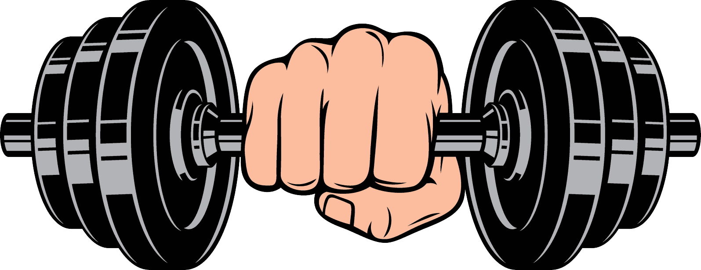
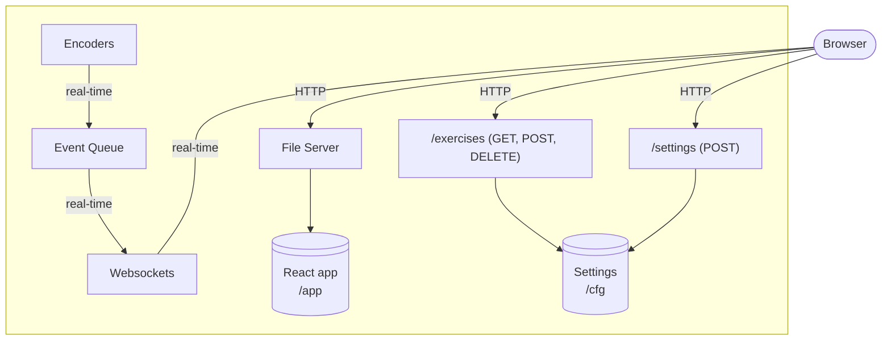
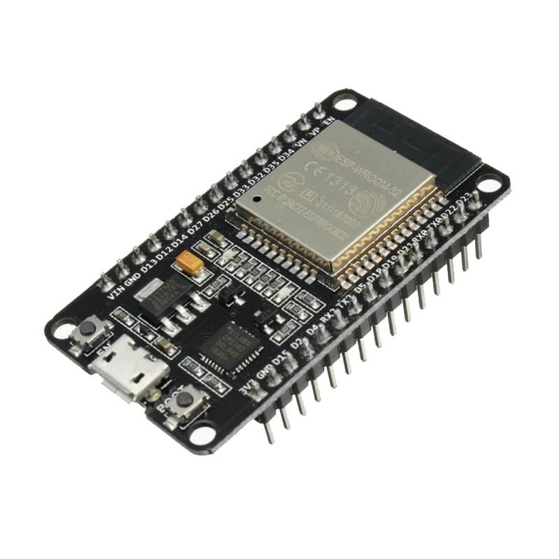
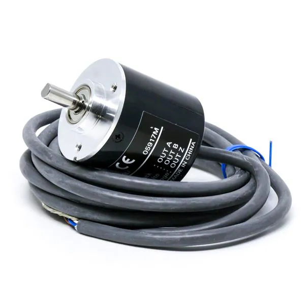
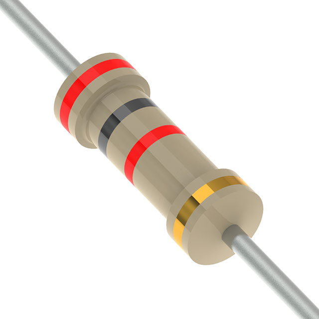
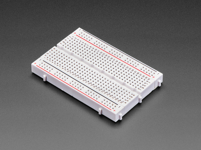
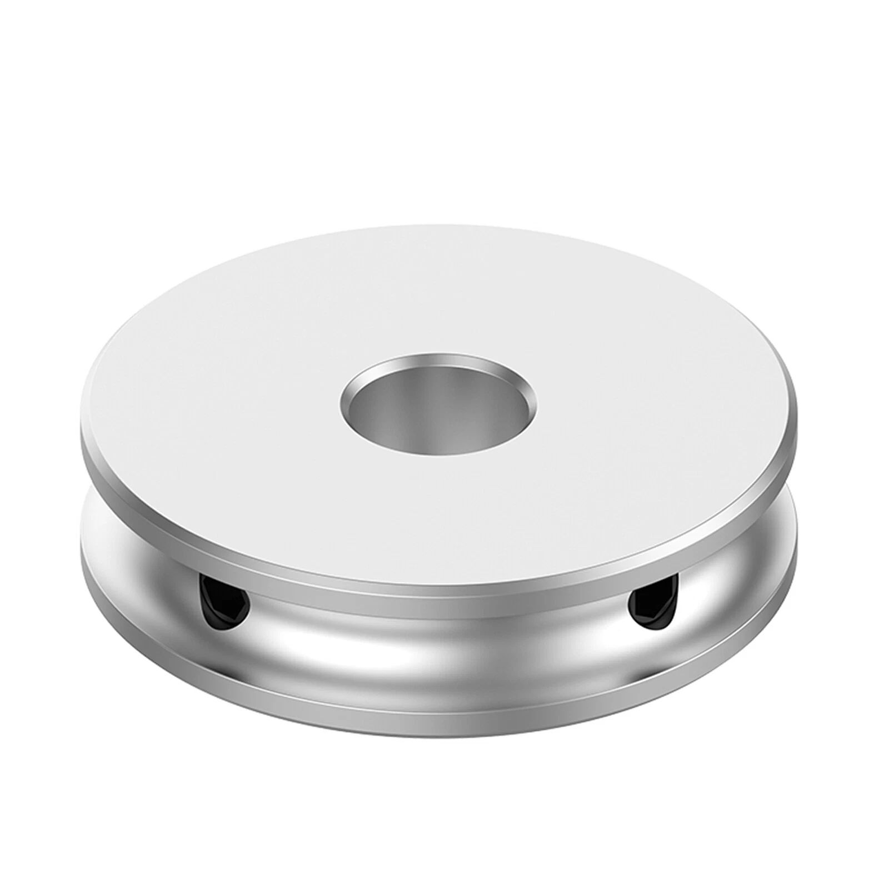
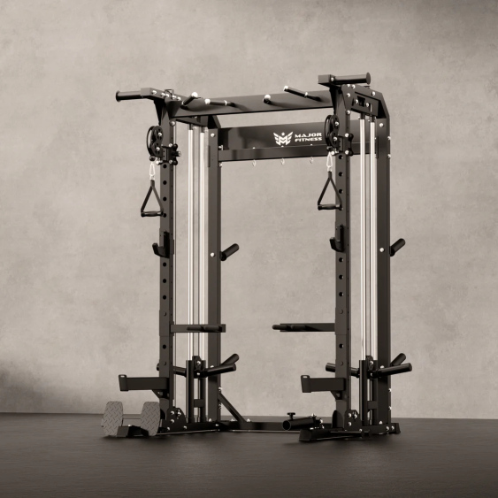
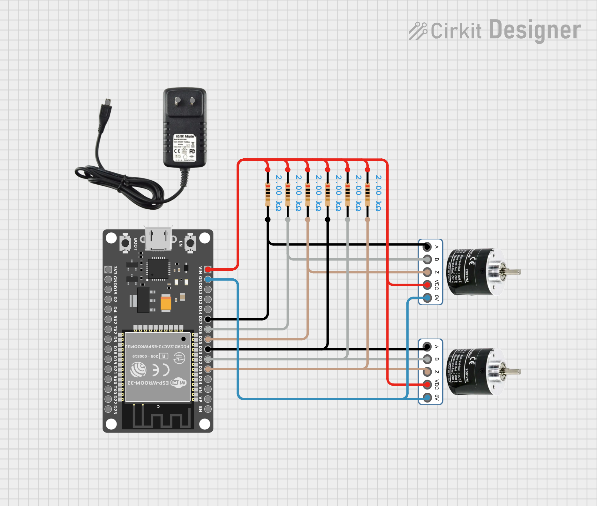

<div align="center">
  

  # ESP Lift
  
</div>

ESP32-based rep counter for cable machines.

- Hosts its own web application and communicates via WebSockets with it for live updates.
- Supports adding custom exercises with persistence in the device.
- Calibrates with a simple cable pull across the machine's range-of-motion.
- Stores workout history in the browser's local storage, with support for exporting.

## How to build

First, set up Wi-Fi credentials and defaults under the `cfg` directory.

Next, make sure you have [devenv](https://devenv.sh/getting-started/) installed, then go into the project root, and execute:

```sh
devenv shell

# Builds web app and ESP binary, flashes, and opens serial monitor
# Options:
# --flash-size=(4mb)|2mb - destination ESP32 flash size
# --build-only - do not flash and open monitor
build
```

## Architecture

Technologies: C and Typescript/React.



## Hardware

<table>
  <tr>
    <td align="center" style="width: 33%; vertical-align: top;">
      <br>
      An <a href="https://joy-it.net/en/products/SBC-NodeMCU-ESP32-C">ESP32</a>, any will do. I use the original version in my project
    </td>
    <td align="center" style="width: 33%; vertical-align: top;">
      <br>
      2x OMRON E6B2-CWZ6C 600P/R (<a href="https://www.ia.omron.com/data_pdf/cat/e6b2-c_ds_e_6_3_csm491.pdf">Datasheet</a>)
    </td>
    <td align="center" style="width: 33%; vertical-align: top;">
      <br>
      <strong>Optional:</strong> 6x 2k resistors for the pull-ups. Alternatively you could try the internal pull-up from the ESP32
    </td>
  </tr>
  <tr>
    <td align="center" style="width: 33%; vertical-align: top;">
      <br>
      Run-of-the-mill breadboard to put it together
    </td>
    <td align="center" style="width: 33%; vertical-align: top;">
      <br>
      2x V-Groove step pulleys. Ensure it has a bore of 6mm
    </td>
    <td align="center" style="width: 33%; vertical-align: top;">
      <br>
      Your cable machine
    </td>
  </tr>
</table>

> You will also need a way to affix the encoders to a stable base in your cable machine. I will leave that to you.

## Wiring



## Licensing

[shadcn/ui](https://ui.shadcn.com/) used under [MIT license](https://github.com/shadcn-ui/ui/blob/main/LICENSE.md).
